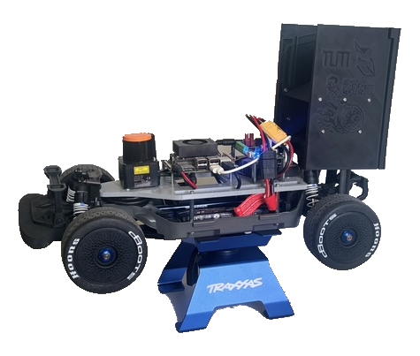

# TUM Faster Than Real-Time Build

This document outlines the build used by the TUM Faster Than Real-Time team for Roboracer, former F1TENTH, competitions.
We provide the BOM on the basis of the Traxxas Fiesta SL VXL + Orin Nano platform, updated
from [https://github.com/TUM-AVS/F1TENTH-Auxiliaries](https://github.com/TUM-AVS/F1TENTH-Auxiliaries/tree/main/F1TENTH%20-%20Bill%20of%20Materials%20Deutschland%3A%20Germany%3A%20EU).
The links typically lead to shops where the components can be ordered in Germany.
Additionally, suggested components to upgrade and *tune* the base configuration are given (in compliance with the
Roboracer rules).
Include the local file in docs as image here:

## Overview

- **Platform:** Traxxas TRX74276-4 Ford Fiesta ST Rally VXL RTR 1:10
- **Target Application:** Autonomy Platform with Orin Nano Integration
- **Purchase Method:** Mixed (invoice & direct)

## Bill of Materials

### Main Body

| Component                                            | Qty | Cost in EUR | Comments | Link                                                                                                                                |
|:-----------------------------------------------------|:----|:------------|:---------|:------------------------------------------------------------------------------------------------------------------------------------|
| Traxxas TRX74276-4 Ford Fiesta ST Rally VXL RTR 1:10 | 1   | 429.95      |          | [rcfox](https://www.rcfox.de/TRX74276-4ORNG-Traxxas-Ford-Fiesta-ST-orange-1/10-Rally-VXL-RTR-Brushless)                             |
| 2 Lipos and Charger Combo                            | 1   | 249.95      |          | [monsterhopups](https://www.monsterhopups.de/Traxxas-TRX2990GX-POWER-PACK-Dual-EZ-Peak-Plus-Ladegeraet-2x-ID-LiPo-111V-5000mah-25C) |

### Compute Module

| Component                                        | Qty | Cost in EUR | Comments                                                                    | Link                                                                                                                          |
|:-------------------------------------------------|:----|:------------|:----------------------------------------------------------------------------|:------------------------------------------------------------------------------------------------------------------------------|
| Nvidia Super Developer Kit Jetson Orin Nano 8 GB | 1   | 332.50      |                                                                             | [reichelt](https://www.reichelt.de/de/de/shop/produkt/nvidia_jetson_orin_nano_super_dev_kit_67_tops_8_gb_ddr5-395185)         |
| Micro SD Card 64 GB                              | 1   | 16.0        |                                                                             | [Link](https://www.conrad.de/de/p/sandisk-extreme-microsdxc-karte-128-gb-class-10-uhs-i-stosssicher-wasserdicht-2621014.html) |
| SSD Card 128 GB                                  | 1   | 16.0        |                                                                             | [amazon](https://www.amazon.de/gp/product/B0C53DNY4X/ref=ox_sc_act_title_1?smid=A3JWKAKR8XB7XF&psc=1)                         |
| Wifi Antenna                                     | 1   | 29.988      | Optional, since Jetson has a not so good internal Bluetooth and Wifi module | yes                                                                                                                           |
| Bluetooth Adapter                                | 1   | 14.8988     | see above                                                                   | [Link](https://www.conrad.de/de/p/asus-usb-bt500-bluetooth-stick-5-0-2336738.html )                                           |

### Sensors

| Component               | Qty | Cost in EUR | Comments | Link                                                                                                         |
|:------------------------|:----|:------------|:---------|:-------------------------------------------------------------------------------------------------------------|
| Hokuyo 10LX             | 1   | 1350.00     |          | [roboparts](www.roboparts.de/epages/63257595.sf/sec37340fc51c/?ObjectPath=/Shops/63257595/Products/UST-10LX) |
| ZED 2 camera (optional) | 1   | 449.0       |          | [Link](https://store.stereolabs.com/en-de/products/zed-2)                                                    |

### Electronics

| Component                                                             | Qty | Cost in EUR        | Comments           | Link                                                                                                                                                                                                                                                                       |
|:----------------------------------------------------------------------|:----|:-------------------|:-------------------|:---------------------------------------------------------------------------------------------------------------------------------------------------------------------------------------------------------------------------------------------------------------------------|
| VESC 6 MkVI                                                           | 1   | 413.62             | incl. Customs fees | [Link](https://trampaboards.com/vesc-6-mkvi-the-amazing-trampa-vesc-6-mkvi--gives-maximum-power-original-p-27536.html)                                                                                                                                                     |
| Dualshock 5 for PS5                                                   | 1   | 76.2076            |                    | [Link](https://www.conrad.de/de/p/sony-dualsense-wireless-controller-midnight-black-gamepad-playstation-5-schwarz-2386057.html?hk=SEM&WT.mc_id=google_pla&gad_source=1&gclid=Cj0KCQiAmNeqBhD4ARIsADsYfTf7bROVEh_HibS0lI4BMvAXFILRlXcfWSL6Zm6slvzBWg7Lv8U1Fb0aAhBlEALw_wcB) |
| USB A to USB micro cable (angled)                                     | 1   | 3.9865             |                    | [amazon](https://www.amazon.de/dp/B00S6G7QJ8?ref=ppx_yo2ov_dt_b_fed_asin_title&th=1)                                                                                                                                                                                       |
| Cable to connect the battery with the VESC and powerboard             | 1   | 24.99              |                    | [monsterhopups](https://www.monsterhopups.de/Traxxas-TRX2938XX-2938X-ID-Ladekabel-LiPo-Akku-auf-Balancer-Board-2S-bis-4S-XH)                                                                                                                                               |
| Adapter for Cable to connect the battery with the VESC and powerboard | 1   | 24.99              |                    | [amazon](https://www.amazon.de/dp/B0CF88MG6M?ref=ppx_yo2ov_dt_b_fed_asin_title&th=1)                                                                                                                                                                                       |
| 4mm male to 3,5mm female bullet adapter for VESC to motor connection  | 1   | 7.98               |                    | [amazon](https://www.amazon.de/gp/product/B0BFHWWKX6/ref=ox_sc_act_title_1?smid=A2DHP02AP3KLFT&psc=1)                                                                                                                                                                      |
| Power cord Jetson (Pigtails)                                          | 1   | 1.9872999999999998 |                    | [amazon](https://www.amazon.de/dp/B0CX4P9KXR?ref=ppx_yo2ov_dt_b_fed_asin_title)                                                                                                                                                                                            |
| Shrink tube for Servo cable                                           | 1   | 6.949599999999999  |                    | [Link](https://www.conrad.de/de/p/toolland-has07-schrumpfschlauchsortiment-schwarz-1-set-2574855.html#productDescription )                                                                                                                                                 |
| PPM cable for VESC 6                                                  | 1   | 4.99               |                    | [Link](https://shop.elektro-skateboard.de/eigenbau-tuning/esc-motorregler/vesc/747/ppm-kabel-fuer-vesc-6-esc)                                                                                                                                                              |

### Fasteners

| Component            | Qty | Cost in EUR        | Comments                               | Link                                                                                                                                                 |
|:---------------------|:----|:-------------------|:---------------------------------------|:-----------------------------------------------------------------------------------------------------------------------------------------------------|
| Standoff M3 SW6 45mm | 3   | 36.51              | pack of 100                            | [Link](https://abstandsbolzen-shop.de/abstandsbolzen/stahl/innen-innengewinde/16/stahl-abstandsbolzen-i/i-gewinde-m3-sw-6?number=BM345&c=15)         |
| Standoff M3 SW6 25mm | 3   | 21.6               | pack of 100, for Powerboard            | [Link](https://abstandsbolzen-shop.de/abstandsbolzen/stahl/innen-innengewinde/16/stahl-abstandsbolzen-i/i-gewinde-m3-sw-6?number=BM325&c=15)         |
| Standoff M3 SW6 20mm | 4   | 21.07              | pack of 100, for Jetson                | [Link](https://abstandsbolzen-shop.de/abstandsbolzen/stahl/innen-innengewinde/16/stahl-abstandsbolzen-i/i-gewinde-m3-sw-6?number=BM320&c=15)         |
| Screws M3x14mm       | 10  | 2.142              | pack of 100                            | [Link](https://www.conrad.de/de/p/iso4762-din912-m3x14-zylinderschrauben-mit-innensechskant-vollgewinde-material-a2-blank-100-stueck-865439039.html) |
|                      |     |                    | 3x for Autonomy Platform               |                                                                                                                                                      |
|                      |     |                    | 4x for Jetson bottom                   |                                                                                                                                                      |
|                      |     |                    | 3x for Powerboard bottom               |                                                                                                                                                      |
| Screws M3x8mm        | 9   | 28.9884            | pack of 100                            | [Link](https://www.conrad.de/de/p/toolcraft-888123-zylinderschrauben-m3-8-mm-sechsrund-iso-14579-stahl-verzinkt-100-st-888123.html?refresh=true)     |
|                      |     |                    | 4x for Jetson top                      |                                                                                                                                                      |
|                      |     |                    | 3x for Powerboard op                   |                                                                                                                                                      |
|                      |     |                    | 2x for ZED 2                           |                                                                                                                                                      |
| Screws M3x20mm       | 2   | 3.6294999999999997 | pack of 100, 2x for LiDAR-Camera mount | [Link](https://www.conrad.de/de/p/iso4017-din933-m3x20-sechskantschraube-gewinde-bis-kopf-vollgewinde-material-a2-blank-100-stueck-865407903.html)   |
| Screws M5x           | 2   | 6.366499999999999  | pack of 100, 2x for VESC               | [Link](https://www.conrad.de/de/p/zylinderschraube-din-912-innen-6kt-m5x20-8-8-galv-verz-100st-806478117.html)                                       |

### Miscellaneous

| Component                                                                                             | Qty | Cost in EUR        | Comments | Link                                                                                                                                                                                      |
|:------------------------------------------------------------------------------------------------------|:----|:-------------------|:---------|:------------------------------------------------------------------------------------------------------------------------------------------------------------------------------------------|
| LiPo safety bag like the Aketek Silver Large Size Lipo Battery Guard Sleeve/Bag for Charge & Storage. | 1   | 8.984499999999999  |          | [Link](https://www.conrad.de/de/p/extron-modellbau-lipo-safety-bag-1-st-x6670-1930097.html)                                                                                               |
| RC Car Stand                                                                                          | 1   | 24.954299999999996 |          | [Link](https://www.conrad.de/de/p/absima-1-10-1-8-montagestaender-schwarz-1537809.html)                                                                                                   |
| DisplayPort Dummy                                                                                     | 1   | 8.924999999999999  |          | [Link](https://www.conrad.de/de/p/dp-displayport-dummy-plug-displayport-dummy1-818237411.html#productDescription)                                                                         |
| Wire ferrules for LiDAR cables                                                                        | 1   | 29.99              | set      | [Link](https://www.conrad.de/de/p/quadrios-2005ca001-aderendhuelsen-sortiment-teilisoliert-mehrfarbig-1200-st-2452883.html)                                                               |
| XT90 plug female for power connection VESC                                                            | 1   | 1.9872999999999998 |          | [Link](https://www.conrad.de/de/p/reely-re-6702315-akku-buchse-xt90-vergoldet-1-st-2234105.html?hk=SEM&WT.mc_id=google_pla&gclid=EAIaIQobChMI9e2O5_6XgQMVBQsGAB08HgCrEAQYASABEgKG_PD_BwE) |

### Racetrack

| Component              | Qty | Cost in EUR | Comments | Link                                                                                                                                                                                                                |
|:-----------------------|:----|:------------|:---------|:--------------------------------------------------------------------------------------------------------------------------------------------------------------------------------------------------------------------|
| VEVOR Lüftungsschlauch | 1   | 0.00        |          | [amazon](https://www.amazon.de/dp/B08QCRZYCT?ref=cm_sw_r_apin_dp_03021X4KNGRCM2ANN974&ref_=cm_sw_r_apin_dp_03021X4KNGRCM2ANN974&social_share=cm_sw_r_apin_dp_03021X4KNGRCM2ANN974&previewDohEventScheduleTesting=C) |

Updated: 2025-06027.

### Notes

- Prices are listed in EUR and include 19% German federal tax.
- Prices are subject to change.
- Links point to suggested vendors but can be substituted.
- Ensure quantities are double-checked before ordering.

## Upgrade Components

The following components are suggested for tuning the base configuration.

### Motor and ESC

| Component                                            | Qty | Cost in EUR | Comments | Link                                                                                     |
|:-----------------------------------------------------|:----|:------------|:---------|:-----------------------------------------------------------------------------------------|
| Hobbywing HW30408018 Xerun Justock 13.5 Turn Handout | 1   | 67.95       |          | [Link](https://www.monsterhopups.de/Hobbywing-HW30408018-Xerun-Justock-135-Turn-Handout) |
|                                                      |     |             |          |                                                                                          | 

### Shocks and Suspension

| Component                                                                      | Qty | Cost in EUR | Comments | Link                                                                                                                                                          |
|:-------------------------------------------------------------------------------|:----|:------------|:---------|:--------------------------------------------------------------------------------------------------------------------------------------------------------------|
| Yeah-Racing TRSL-016BU Aluminium TR-XB 90mm Big Bore                           | 1   | 29.99       |          | [Link](https://www.monsterhopups.de/Yeah-Racing-TRSL-016BU-Aluminium-TR-XB-90mm-Big-Bore-Stossdaempfer-fuer-Traxxas-1-10-Slash-Stampede-Bandit-Arrma-RC-Blau) |
| GPM RUS47580FR-R-GD-BEBK Aluminium shock absorber front and rear (LCG version) | 1   | 52.99       |          | [Link](https://www.monsterhopups.de/GPM-RUS47580FR-R-GD-BEBK-Aluminium-shock-absorber-front-and-rear-LCG-version)                                             |

### Tires

The standard size of the Traxxas Fiesta SL VXL is 100mm diameter and 40mm width.

| Component                                      | Qty | Cost in EUR | Comments | Link                                                                                                    |
|:-----------------------------------------------|:----|:------------|:---------|:--------------------------------------------------------------------------------------------------------|
| Arrma ARA550063 DBoots Hoons 42/100 2.9 Belted | 1   | 30,95       |          | [Link](https://www.monsterhopups.de/Arrma-ARA550063-DBoots-Hoons-42-100-29-Belted-Speed-Paar)           |
| Arrma ARA550101 dBoots Hoons 53/100 2.9        | 1   | 28.79       |          | [Link](https://www.monsterhopups.de/Arrma-ARA550101-dBoots-Hoons-53-100-29-Reifensatz-Gold-5-Speiche-2) |

### Other Components

There is a system available to measure the setup of the car and set the suspension and camber angles.

| Component                                                   | Qty | Cost in EUR | Comments | Link                                                                                                                             |
|:------------------------------------------------------------|:----|:------------|:---------|:---------------------------------------------------------------------------------------------------------------------------------|
| YEAH RACING UNIVERSAL ALUMINIUM RC CAR SETUP SYSTEM V3 1/10 | 1   | 49.99       |          | [Link](https://racersparadise.de/YEAH-RACING-UNIVERSAL-ALUMINIUM-RC-CAR-SETUP-SYSTEM-V3-1-10-TOURENWAGEN-YT-0140RD)              |
| Battery Splitter Cable from Traxxas                         | 1   | 49.99       |          | [Link](https://www.monsterhopups.de/ID-charging-cable-from-Traxxas-iD-LiPo-battery-to-balancer-board-3S-XH-16AWG-60mm-TRX2938XX) |
| GPM SLA048N-BK Umlenkhebel Lenkung + Servosaver Aluminium   | 1   | 24.21       |          | [Link](https://www.monsterhopups.de/GPM-SLA048N-BK-Umlenkhebel-Lenkung-Servosaver-Aluminium-7075-T6)                             |

## Further Tuning

Tuning the VESC and motor settings is highly recommended for optimal performance.
The VESC Tool can be used to adjust parameters such as current limits, braking force, and motor timing.
Use the provided VESC 6 MkVI config file as a starting point and adjust according to your needs.
Make sure that active braking is enabled for better control during deceleration.

There is a nice guide from Traxxas about suspension
tuning [here](https://traxxas.com/articles/suspension-tuning-guide-part1).